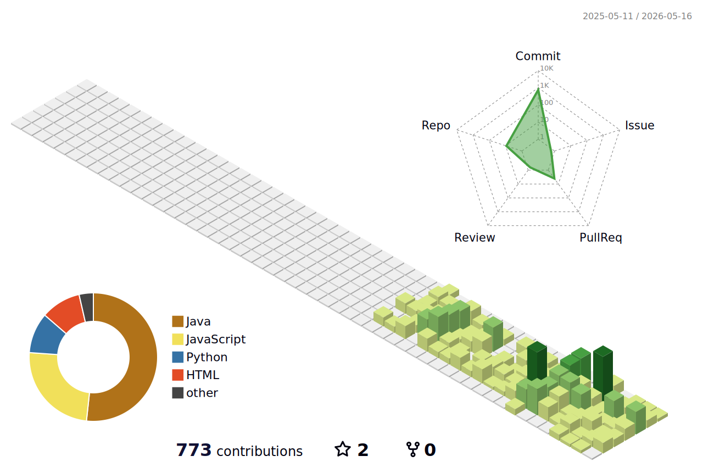

 

## 소통하며 서비스의 생명력을 영속시키는 개발자 박소영입니다.

<!-- 소개글을 정렬하고 귀여운 이모지를 더 추가했어요 -->
**산업경영공학**을 전공하였고
효율적인 코드와 깔끔한 아키텍처를 좋아해요.
 
💌 **Contact** : havesomeso0p@gmail.com

 

### 🛠 Tech Stack

<!-- 뱃지 스타일을 플랫하고 둥글게(flat-square 또는 그냥 기본형) 바꾸고 색감을 파스텔톤으로 다듬었어요! -->

> **Frontend**
>    

> **Backend**
>    

> **Data & Scripting**
> 

> **Tools**
>  

 

### 🏆 Contribution

<!-- 포켓몬 등장! -->

  

